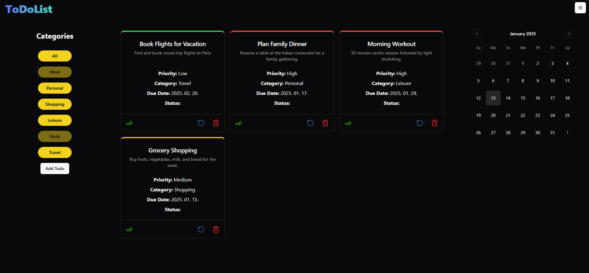

# React + Vite +Tailwind CSS + ShadCN Ui 

Az alkalmazás célja a Contextusok, TailwindCss és a ShadCN UI használatának és integrációjának gyakorlása egy modern React alkalmazásban.

Full responsive, támogatja a sötét módot , Todo létrehozása/szerkesztése/törlése/ összes lekérése 
Összes kategóriát egybe és kategóriák szerint is megjeleníti . 
Naptárból is elérhető a létrehozás. 

## Telepítés
1. Klónozd le a projektet:
2. Navigálj a project könyvtárába és telepítsd a szükséges függőségeket
3. indítás : npm run dev

